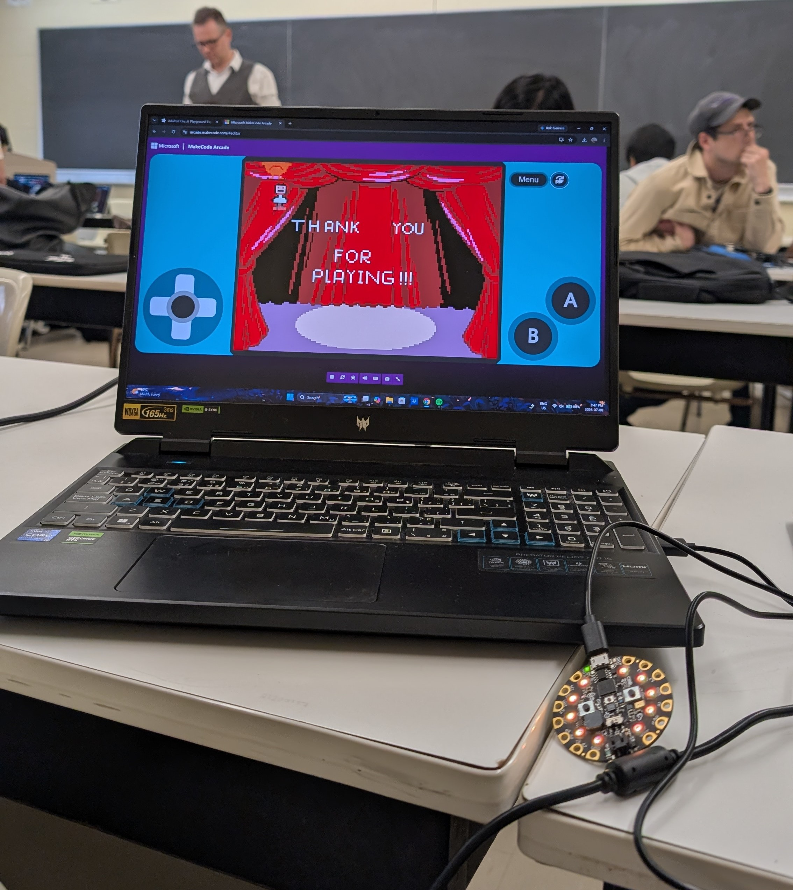
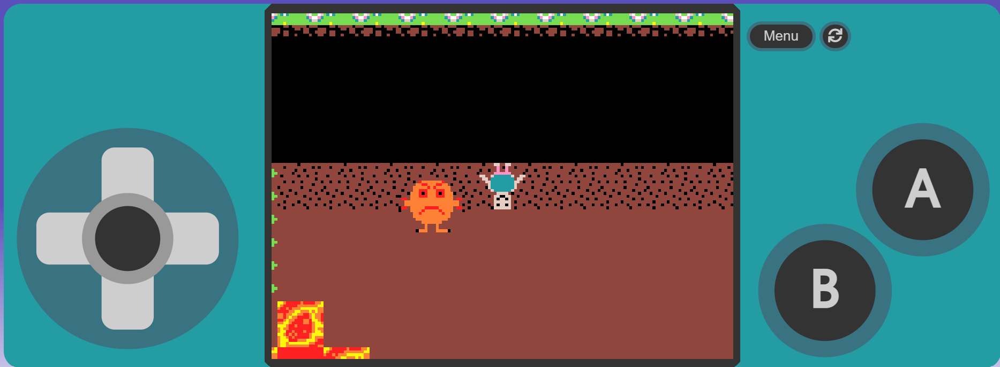

# The Upside Down Arcade Game

A physical-platformer game built with **MakeCode Arcade** and a **Circuit Playground Express**.

The player navigates three levels while switching between the normal world and the **Upside Down** to overcome obstacles and reach the goal.

## Physical Setup

Physical Circuit Playground Express controller during the final stage of gameplay.

## Gameplay

Three-level platformer featuring world switching, enemies, hazards, and level progression.

## Features

* 3 playable levels
* Normal / Upside Down world switching
* Enemies and hazards
* Custom tilemaps and game logic
* Physical controller input using Circuit Playground Express
* Level progression and restart logic

## Controls

* **A** — Enter the Upside Down
* **B** — Return to the normal world
* **Down** — Freeze enemies

## Built With

* MakeCode Arcade
* TypeScript
* Circuit Playground Express

## What I Built

Designed and implemented the game mechanics, level logic, controls, physical controller interaction, and level progression.
